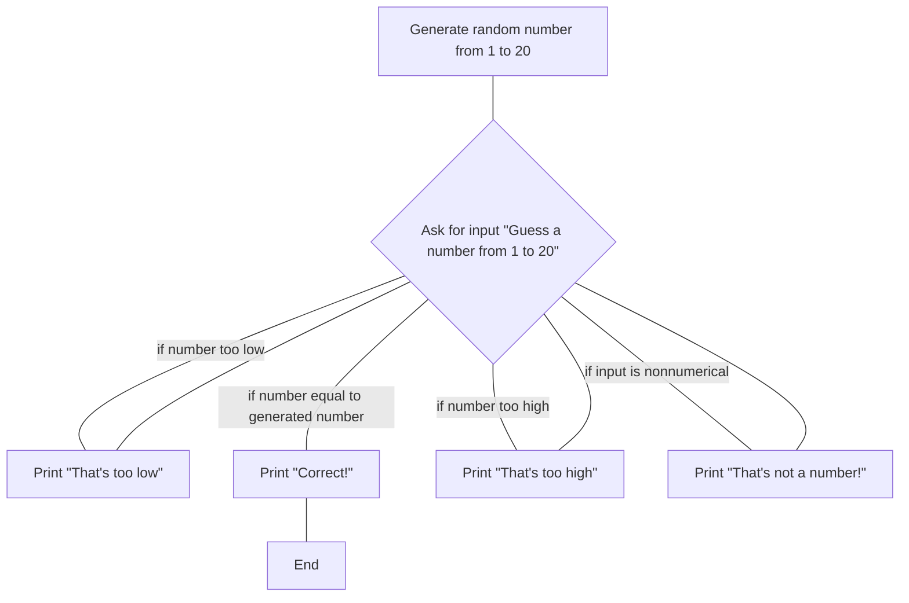

Here's a simple flowchart algorithm for a number guessing game

```mermaid
graph TD
    A[Generate random number from 1 to 20] --- B{Ask for input #quot;Guess a number from 1 to 20#quot;}
    B -- if number too low --- C[Print #quot;That's too low#quot;] --- B
    B -- if number equal to generated number --- D[Print #quot;Correct!#quot;]
    B -- if number too high --- E[Print #quot;That's too high#quot;] --- B
    D --- F[End]
    B -- if input is nonnumerical --- G[Print #quot;That's not a number!#quot;] --- B
```
